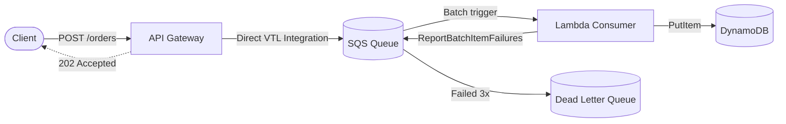

# Serverless Async Ingestion API

An asynchronous order ingestion service built on AWS using Terraform and Python. Designed to handle burst traffic without dropping requests or overloading downstream storage.

## Architecture



### Why this setup?

- **No Lambda on ingestion**: Most serverless APIs put a Lambda behind API Gateway just to write incoming requests into SQS. Here, API Gateway uses a direct AWS service integration via Velocity Template Language (VTL). This removes unnecessary compute, cuts cold starts on the ingestion path, and saves cost under heavy load.
- **Edge validation**: API Gateway validates the request body against a JSON Schema model before writing to SQS, returning `400 Bad Request` right away if required fields are missing.
- **Queue as a buffer**: SQS absorbs traffic spikes (e.g. flash sales) and lets Lambda process orders at a controlled rate into DynamoDB.
- **Partial batch responses (`ReportBatchItemFailures`)**: When Lambda processes a batch of up to 10 messages and one fails, only the failed message ID is returned. SQS only re-queues that specific message instead of retrying the whole batch.
- **Idempotent writes**: DynamoDB `put_item` uses a condition expression (`attribute_not_exists(PK) AND attribute_not_exists(SK)`) so retried SQS deliveries won't create duplicate orders.

## Project Structure

```text
├── infra/                  # Terraform configurations
│   ├── api_gateway.tf      # REST API, JSON schema validator, SQS integration
│   ├── dynamodb.tf         # DynamoDB table and GSI
│   ├── iam.tf              # Least-privilege IAM roles and policies
│   ├── lambda.tf           # Lambda definition and SQS event mapping
│   ├── sqs.tf              # SQS queue and DLQ
│   └── outputs.tf          # API endpoint and resource outputs
├── src/
│   ├── handler.py          # SQS batch consumer
│   ├── models.py           # Pydantic models for payload validation
│   └── requirements.txt
├── tests/
│   ├── test_handler.py     # Unit tests using Moto
│   └── requirements-dev.txt
└── load_test/
    └── load_test.py        # Concurrent test script to simulate traffic
```

## Example Payload

`POST /orders` returns `202 Accepted`:

```json
{
  "order_id": "ord-98231",
  "customer_id": "cust-4412",
  "items": [
    {
      "item_id": "sku-101",
      "quantity": 2,
      "unit_price": 29.99
    }
  ],
  "total_amount": 59.98,
  "currency": "EUR",
  "created_at": "2026-09-30T10:00:00Z"
}
```

## Running Locally

Unit tests mock DynamoDB using `moto` and do not require AWS credentials:

```bash
python -m venv .venv
# Linux/macOS:
source .venv/bin/activate
# Windows:
.venv\Scripts\activate

pip install -r tests/requirements-dev.txt
pytest tests/ -v
```

## Deploying to AWS

Requires Terraform >= 1.5 and configured AWS credentials.

```bash
cd infra
terraform init
terraform apply
```

Terraform outputs the API endpoint URL once applied.

## Load Testing

To test how the API and queue handle concurrent traffic:

```bash
python load_test/load_test.py --url "<API_ENDPOINT>" --total 200 --concurrency 20
```

## Cleanup

```bash
cd infra
terraform destroy
```
